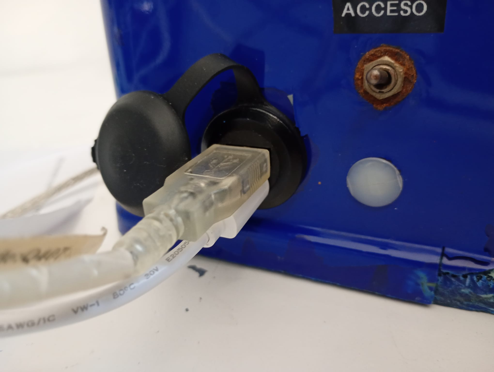
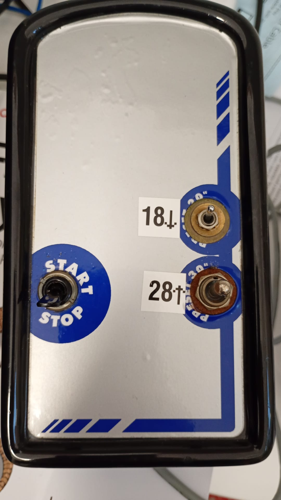
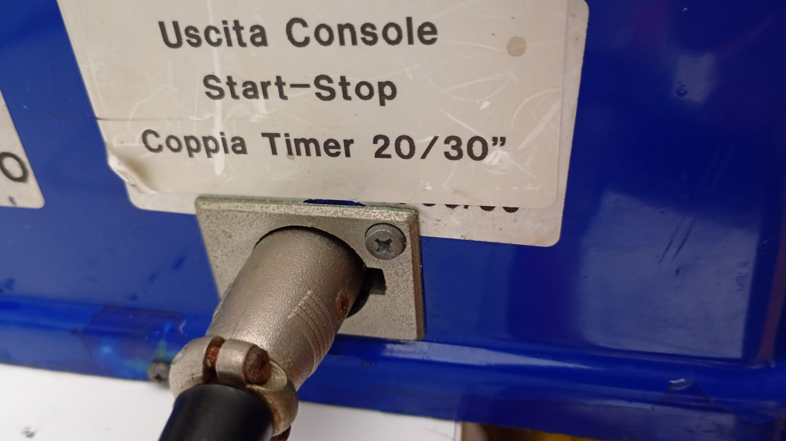
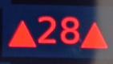
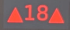
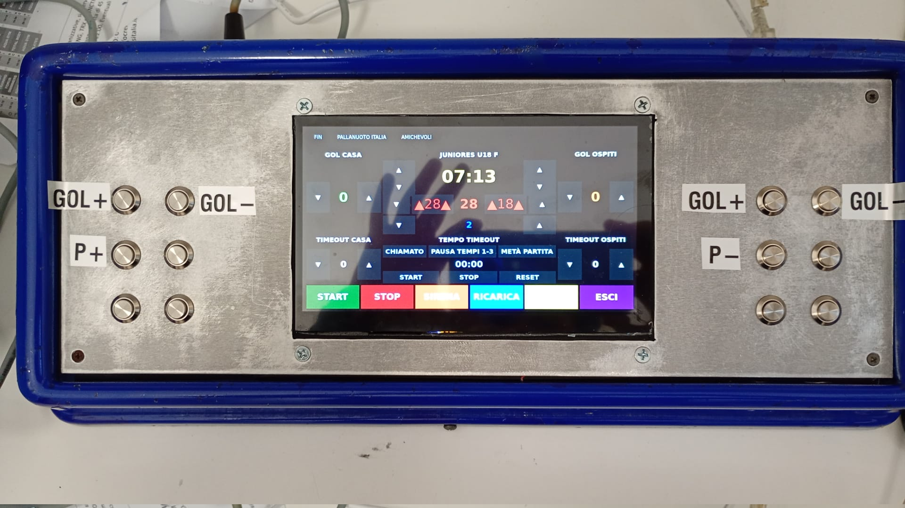
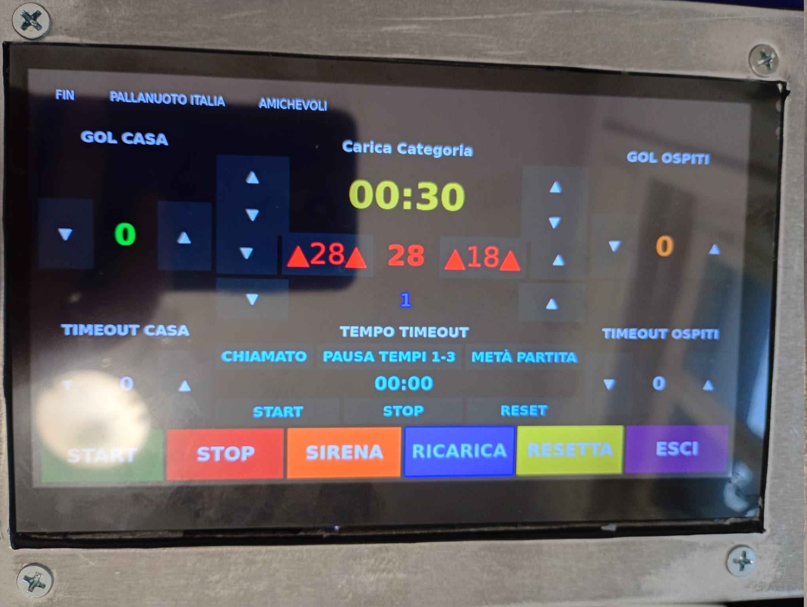
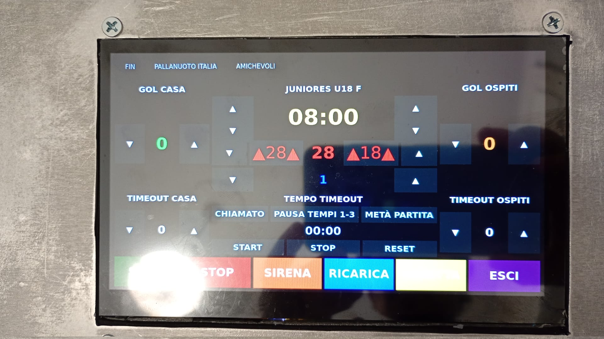

# Manuale operativo

## Componenti

- Consolle con schermo touch e pulsantiera
- Tabellone
- Segnatempo per possesso palla

## Preparazione del campo gara

Tutti gli oggetti sono alimentati tramite alimentatori a 24V. Ci sono 3 alimentatori neri per il tabellone ed
i segnatempo ed un alimnentatore bianco con uscita USB-C per la consolle. *Non servono più le antennine che venivano
montate prima sul tabellone e sui segnatempo.

La consolle è touch e in aggiunta ha una pulsantiera esterna che:

- permette lo start e stop del tempo di gioco
- reset del possesso palla a 28 secondi
- reset del possesso palla a 18 secondi

Dove non è previsto l'uso dei segnatempo aggiuntivi basta non accenderli. I tasti di reset della pulsantiera saranno in
automatico disabilitati e si userà solo la levetta di START/STOP.

### Preparare la console:

Bisogna connettere

- antenna USB
- alimnetazione USB-C

e lo si fa tramite il connettore nero posto sul retro della console

L'antenna è fondamentale per permettere alla console di fare da hotspot e accettare la connessione dei segnatempo e del
tabellone. **Senza di essa non sarà possibile connettere alcun dispostivo**

Collegare la pulsantiera  e mettere la leva su STOP. La spina va inserita
nell'apposito foro a 3 poli sul retro della console. 

### Preparare il tabellone e i segnatempo

L'unica cosa da fare è connetterli tramite l'alimentatore alla rete elettrica. Appena accesi cominceranno un countdown
con valori **99, 77, 55, 33, 11** fino a quando non si connetteranno alla console centrale che li inizializzerà 
correttamente. Il sistema è tutto automatizzato.

## Descrizione della consolle

### Gui su schermo touchscreen

L'interfaccia grafica riporta

- Categorie di gioco
- GOL in casa 
- Tempo di gioco in giallo
- GOL ospiti
- Tempo di possesso palla in rosso
- Periodo di gioco in blu
- Timeout richiesti dalla squadra di casa
- Tempo di timeout
- Timeout richiesti dalla squadra ospite

Per ognuno dei campi ci sono delle frecce in su e giù per aumentare o diminuire il valore dl rispettivo campo.
Ci sono poi i bottoni
- Start
- Stop
- Sirena
- Ricarica
- Resetta
- Esci

Il comando START del touchscreen equivale allo START sulla pulsantiera esterna

Il comando STOP del touchscreen equivale allo STOP sulla pulsantiera esterna

il comando  equivale al reset dei 28 secondi sulla pulsantiera esterna
Il comando  equivale al reset dei 18 secondi sulla pulsantiera esterna

### Pulsanti laterali

La consolle ha anche dei pulsanti laterali al touchscreeen

A sinistra i gol per la squadra di casa ed il pulsante per incrementare il periodo P
A destra per la squadra ospite ed il pulsante per diminuire il periodo P in caso di errore.

## Gestione della partita.

Una volta accesa la consolle si avvierà e dopo circa un minuto mostrerà in automatico la schermata iniziale

. La schermata iniziale mostra un tempo di gioco di 30 secondi e sopra la scritta
**Carica categoria**

### Caricare una categoria di gioco

Basta scegliere dal menu sopra dove si trova

- FIN
  - Esordienti
  - Ragazzi
  - Allieve 16F
  - Allievi 16M
  - Juniores Femminile
  - Promozione
- PALLANUOTO ITALIA
  - Master
- Amichevoli.

Ad esempio per scegliere la categoria **Juniores Femminile** mettere il dito su FIN e scorrere senza toglierlo fino al
menu **Juniores Femminile** quindi rilasciare. Al posto di **Carica categoria** apparirà  **Juniores Femminile** e
verranno caricati i dati relativa a questa categoria: tempo 8 minuti, tempo di possesso palla 28 secondi.

Se invece si scegliesse la categoria **Esordienti** il tempo di possesso palla resterà sempre a **0** perchè non è
previsto per quella categoria.

**Una volta iniziata la partita non selezionare più la categoria, pena il reset di tutto ai dati iniziali.**

### Azioni durante la partita

Per iniziare la partita spingere verso START la levetta della pulsantiera oppure cliccare col dito sul pulsante verde
di START.
Il tempo di gioco in giallo e di possesso palla in rosso inizieranno a diminuire.

Se il tempo di possesso arriva a 0 la sirena suonerà ed il tempo di possesso verrà riportato a 28 secondi. Per riprendere
il gioco bisogna rimettere la levetta su STOP e poi di nuovo su START quando la squadra in possesso palla ripartirà.
** Dopo la fine del posesso palla che ha portato al suone della sirena bisogna sempre fare uno STOP e START sulla pulsantiera esterna 
per ripartire oppure premere il pulsante verde di START sul touchscreen**

Per resettare i 28 secondi prima del loro scadere basta mandare verso l'alto la levetta corrispondente.
Per resettare i 18 secondi prima del loro scadere basta mandare verso il basso la levetta corrispondente.

Per fermare il gioco mettere la levetta su STOP.
per far ripartire il gioco sempre su START.

Dopo un gol premere il relativo bottone per mandare al tabellone il gol segnato e visualizzarlo anche sul touchscreen.

### Fine di un periodo

Quando il tempo di gioco del periodo finisce bisogna premere il bottone **RICARICA** per riportare il tempo di gioco al
valore iniziale. Il bottone **RICARICA** non modifica altro.

### Timeout

Ci sono diverse opzioni per il timeout;

- chiamato da una delle squadre (Pulsante CHIAMATO)
- fine primo o terzo periodo (Pulsante PAUSA TEMPI 1-3)
- Metà partita (Pulsante METÀ PARTITA)

Per usare il timeout scegliere uno dei 3 Pulsanti sul touchscreeen: al posto di 00:00 verrà mostrato il tempo di quel
timeout: premere sul bottone piccolo START appena sotto il tempo (**NON QUELLO VERDE**) e il timeout partirà: al suo
termine verrà suonata la sirena. Se le squadre iniziassero prima basta premere su STOP e poi su RESET, sempre quelli del
menu timeout.

Se il timeout è stato chiamato da una delle squadre basta incrementare con le frecce il timeout di casa o degl ospiti.

## Riassunto

Collegare alla consolle:

- Antenna
- Alimentazione
- pulsantiera Start/Stop e reset dei tempi
- Attendere che sul touch appaia l'interfaccia di gioco
- Caricare una categoria
- Verificare che sui segnatempo ci siano i 28 secondi
- Verificare che sul tabellone ci sia lo stesso tempo della categoria e il risultato di 0 a 0 con periodo 1

A questo punto tutte le azioni della partita si possono gestire SOLO con la pulsantiera esterna che permette

- START
- STOP
- RESET a 28 secondi
- RESET a 18 secondi.

Tramite i pulsanti esterni o i corrispettivi sul touch si possono:

- Aumentare o diminuire i gol in casa e trasferta
- Aumetare o diminuire il periodo

Solo tramite touchscreen si può:

- Caricare il tempo di timeout
- Aumentare o diminuire il numero di timeout chiamati dalle squadre
- Start/Stop e Reset del timeout

